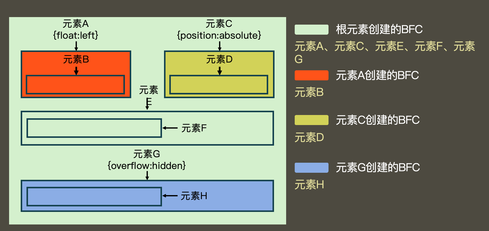
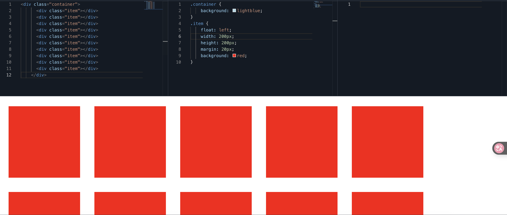
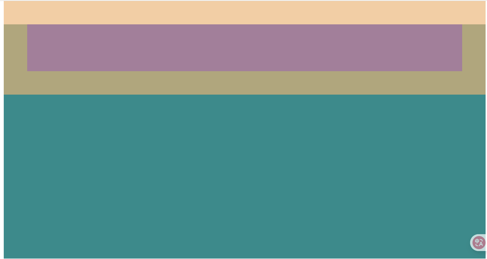
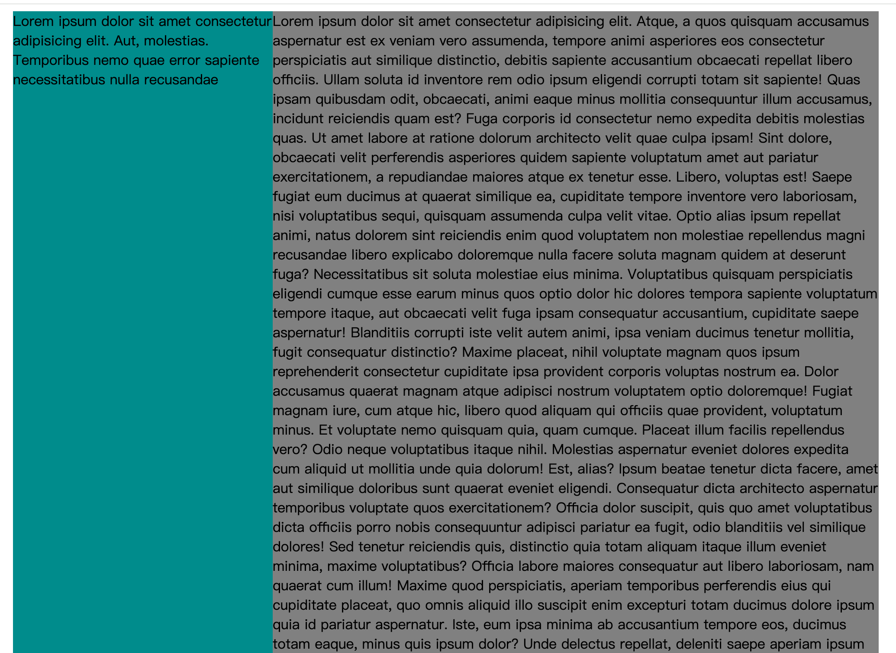
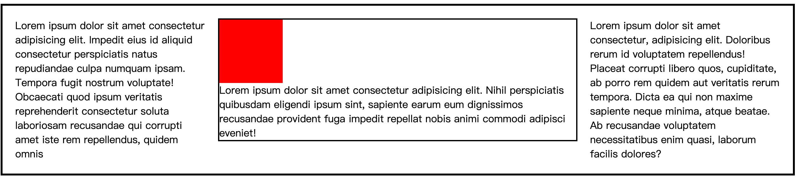

## @规则

at-rule: @规则、@语句、CSS语句

- import，写法 @import “路径” 导入另外一个css文件
- charset “utf-8” 告诉该游览器使用的字符编码集（必须写到第一行）

## web字体和图标

### web字体
解决用户电脑上没有安装相应字体的问题，强制让用户下载该字体

使用@font-face指令制作一个字体

### 字体图标
网站：www.iconfont.cn


## 块级格式化上下文（BFC）
它是一块**独立的渲染区域**，它规定了在该区域中，常规流块盒的布局
- 常规流块盒在水平方向上，必须撑满包含块
- 常规流块盒在包含块的垂直方向上依次摆放
- 常规流块盒若外边距无缝相邻，则进行外边距合并
- 常规流块盒的自动高度和摆放位置，无视浮动元素

BFC渲染区域：这个区域有某个HTML元素创建，以下元素会在其内部创建BFC区域
1. 根元素
2. 浮动和绝对定位元素
3. overflow不等于visible的块盒



不同的BFC区域，它们进行渲染时互不干扰

创建BFC的元素，隔绝了它内部和外部的联系，内部的渲染不会影响到外部
具体规则
- 创建BFC的元素，它的自动高度需要计算浮动元素
在以下图片中container容器的背景颜色未显示出来，是因为高度塌陷了，在以前的写法中可以使用clearfix来消除，
现在则可以使用以下方法
1. 创建绝对定位（position： absolute）（不推荐）
2. 使用浮动：float：left（不推荐）
3. 副作用最小的方式使用 overflow：hidden （最推荐，只要不是visiable就行）
::: info 提示
如果仅仅是解决高度坍塌，还是推荐以前的方法，这里只是介绍一个可用的方法
:::   

- 创建BFC的元素，它的边框盒不会与浮动元素重叠

在以下代码中表明常规流元素在摆放时看不见浮动的元素，如果要设置左边和右边的边距要设置左边的margin-right才有效，设置右边的margin-left无效。**此方法可以用于左边固定，右边自动适应的场景**

- 创建BFC的元素，不会和它的子元素进行外边距合并（处在不同bfc的元素，它们的外边距不会合并）

以下代码中的container容器和child子元素，它们的外边距就合并了
```html
<style>
      .container {
        background: #008c8c;
        height: 500px;
        margin-top: 30px;
        /* overflow: hidden; */
      }
      .child {
        height: 100px;
        margin: 50px;
        background: red;
      }
    </style>
  </head>
  <body>
    <div class="container">
      <div class="child"></div>
    </div>
  </body>
</html>
```



## 布局

### 多栏布局

两栏布局

:::: details 代码
```html
<!DOCTYPE html>
<html lang="en">
  <head>
    <meta charset="UTF-8" />
    <meta name="viewport" content="width=device-width, initial-scale=1.0" />
    <title>Document</title>
    <style>
      .clearfix::after {
        content: "";
        display: block;
        clear: both;
      }
      .container {
        background: lightblue;
        width: 1000px;
        margin: 0 auto;
        /* 新增 */
        overflow: hidden;
      }
      .aside {
        float: left;
        background: #008c8c;
        width: 300px;
        /* 新增 */
        height: 10000px;
        margin-bottom: -9990px;
      }
      .main {
        /* float: right;
        width: 600px; */
        overflow: hidden;
        background: gray;
      }
    </style>
  </head>
  <body>
    <div class="container clearfix">
      <aside class="aside">
        Lorem ipsum dolor sit amet consectetur adipisicing elit. Aut, molestias.
        Temporibus nemo quae error sapiente necessitatibus nulla recusandae
      </aside>
      <div class="main">
        Lorem ipsum dolor sit amet consectetur adipisicing elit. Atque, a quos
      </div>
    </div>
  </body>
</html>
```
::::

三栏布局

:::: details 代码
```html
<!DOCTYPE html>
<html lang="en">
  <head>
    <meta charset="UTF-8" />
    <meta name="viewport" content="width=device-width, initial-scale=1.0" />
    <title>Document</title>
    <style>
      .clearfix::after {
        content: "";
        display: block;
        clear: both;
      }
      .container {
        border: 3px solid;
        padding: 20px;
      }
      .left {
        float: left;
        width: 300px;
        margin-right: 20px;
      }
      .right {
        float: right;
        width: 300px;
        margin-left: 20px;
      }
      .main {
        overflow: hidden;
        border: 2px solid;
      }
    </style>
  </head>
  <body>
    <div class="container clearfix">
      <aside class="left">
        Lorem ipsum dolor sit amet consectetur adipisicing elit. Impedit eius id
        aliquid consectetur perspiciatis natus repudiandae culpa numquam ipsam.
        Tempora fugit nostrum voluptate! Obcaecati quod ipsum veritatis
        reprehenderit consectetur soluta laboriosam recusandae qui corrupti amet
        iste rem repellendus, quidem omnis
      </aside>
      <aside class="right">
        Lorem ipsum dolor sit amet consectetur, adipisicing elit. Doloribus
        rerum id voluptatem repellendus! Placeat corrupti libero quos,
        cupiditate, ab porro rem quidem aut veritatis rerum tempora. Dicta ea
        qui non maxime sapiente neque minima, atque beatae. Ab recusandae
        voluptatem necessitatibus enim quasi, laborum facilis dolores?
      </aside>
      <div class="main">
        <div style="width: 100px; height: 100px; background: red"></div>
        Lorem ipsum dolor sit amet consectetur adipisicing elit. Nihil
        perspiciatis quibusdam eligendi ipsum sint, sapiente earum eum
        dignissimos recusandae provident fuga impedit repellat nobis animi
        commodi adipisci eveniet!
      </div>
    </div>
  </body>
</html>
```

::::

### 等高
1. CSS3弹性盒
2. JS控制
3. 伪等高


### 元素书写顺序
1. 先写浮动元素


### 后台页面的布局


## 行高的取值

line-hight

1. 像素值，px
2. 无单位数字
3. em单位
4. 百分比


## body的背景

**画布 canvas** （不是html5中的canvas元素）

一块区域
特点：
1. 最小宽度为视口宽度
2. 最小高度为视口高度

**HTML元素的背景**覆盖画布

**BODY元素的背景**如果HTML元素有背景，body元素正常（背景覆盖边框盒）
如果HTML元素没有背景，BODY元素的背景覆盖画布


**关于画布背景图**
1. 背景图的宽度百分比，相对于视口
2. 背景图的高度百分比，相对于html元素
3. 背景图的位置百分比、预设值，相对于视口
4. 背景图的纵向位置百分比、预设值，相对于网页高度

## 行盒的垂直对齐

### 多个行盒垂直方向的对齐
给没对齐元素设置 vertical-align
- 预设值
- 数值

### 图片的底部白边

图片的父元素是一个块盒，块盒高度自动，图片底部和父元素底边之间往往会出现空白 
1. 设置父元素的字体大小为0，font-size: 0; 副作用：如果父元素中有字就看不见了
2. 将图片设置为块盒（行块盒都不行）


## 参考线-深入理解字体

font-size、line-hight、vertical-aligen、font-family

### 文字
文字是通过一些文字制作软件制作的例如：fontforge
制作文字时，会有几根参考线，不同的文字类型，参考线不一样，同一种文字类型，参考线相同


### font-size
字体大小，设置的是文字的相对大小
文字的相对大小：1000、2048、1024

文字顶线到底线的距离，是文字的实际大小（content-area,内容区）
行盒的背景，覆盖content-area


### 行高
顶线向上延伸的空间和底线向下延伸的空间，两个空间相等，该空间叫gap（空隙）
top到botoom，叫virtual-area(虚拟区), 行高就是虚拟区，可以进行设置


line-height：normal，默认值
文字一定出现在一行到最中间 （错误）
content-area一定出现在virtuak-area的中间 


### vertical-align
一个元素如果子元素出现行盒，该元素内部也会产生参考线

baseline：该元素的基线于父元素的基线对齐
super：该元素的基线与父元素的上基线对齐
sub：该元素的基线与父元素的下基线对齐
text-top：该元素的virtual-area的顶边，对齐父元素的text-top
text-bottom：该元素的virtual-area的底边，对齐父元素的text-bottom
top：该元素的virtual-area的顶边，对齐父元素的top（该行中的最高顶边）
bottom：该元素的virtual-area的底边，对齐父元素的bottom

实际，一个元素的实际占用高度（高度自动），高度的计算通过line-box计算。
行盒组合起来，可以形成多行，每一行的区域叫做line-box，line-box的顶边是该行内所有行盒的最高顶边，底边是该行行盒的最低底边
行盒：inline-box
行框：line-box

数值：相对于基线的偏移量，向上为正数，向下为负数。

百分比：相对于基线的偏移量，百分比是相对于自身virtual-area的高度

line-box是承载文字内容的必要条件，以下情况不生成行框：

1. 某元素内部没有任何行盒
2. 某元素字体大小为0


### 可替换元素和行块盒的基线

图片：基线位置位于图片的下外边距。
表单元素：基线位置在内容底边
行块盒：
1. 行块盒最后一行有line-box，用最后一行的基线作为整个行块盒的基线。
2. 如果行块盒内部没有行盒，则使用下外边距作为基线


## 堆叠上下文

堆叠（层叠）上下文（stack context），它是一块区域，这块区域由某个元素创建，它规定了该区域中的内容在轴上排列的先后顺序。

### 创建堆叠上下文的元素
1. html 元素（根元素）
2. 设置了z-index数值的定位元素（非auto值）


### 同一个堆叠上下文中元素在z轴上的排列
从后到前的排列顺序：

1. 创建堆叠上下文的元素的背景和边框
2. 堆叠级别(z-index, stack level)为负值的堆叠上下文
3. 常规流非定位的块盒
4. 非定位的浮动盒子
5. 常规流非定位行盒
6. 任何 z-index 是 auto 的定位子元素，以及 z-index 是 0 的堆叠上下文
7. 堆叠级别为正值的堆叠上下文

每个堆叠上下文，独立于其他堆叠上下文，它们之间不能相互穿插。


## SVG

svg：scalable vector graphics，可缩放的矢量图

1. 该图片使用代码书写而成
2. 缩放不会失真
3. 内容轻量


### 怎么使用
svg可以嵌入游览器，也可以单独成一个文件
xml语言，svg使用该语言定义
### 书写svg代码

#### 矩形:rect
fill:填充颜色
stock：边框颜色
x，y设置位置


#### 圆形：circle
cx，cy设置圆的中心点坐标，r 半径

#### 椭圆：ellipse
rx，ry设置椭圆的半径

#### 线条：line
x1,y1、x2、y2 设置两点的坐标

#### 折线：polyline

#### 多边形：polygon

#### 路径：path

M = moveto
L = lineto
H = horizontal lineto
V = vertical lineto
C = curveto
S = smooth curveto
Q = quadratic Belzier curve
T = smooth quadratic Belzier curveto
A = elliptical Arc

A
半径1    
半径2     
顺时针旋转角度    
小弧（0）或大弧（1）   
顺时针（1）逆时针（0）

Z = closepath

### 例子

画太极图


## 数据链接

data url 是一种特殊的 url ，它可以直接在 html 中嵌入数据，而不需要通过 http 请求获取。

数据链接：将目标文件的数据直接书写到路径位置
语法：data：MIME,数据

```html
<link rel=stylesheet href="data:text/css,h1{color:blue;}">
```
还有图片等

### 意义
优点：
1. 减少了游览器等请求（减少了请求中浪费的时间）
2. 有利于动态生成数据

缺点：
1. 增加了资源的体积 （导致了传输内容增加，从而增加了单个资源的传输时间）
2. 不利于游览器缓存（游览器通常会缓存图片文件、css文件、js文件）
3. 会增加原资源的体积到原来的4/3


应用场景：

1. 但请求单个图片体积较小，并且该图片因为各种原因，不适合制作雪碧图，可以使用数据链接。
2. 图片由其他代码动态生成，并且图片较小，可以使用数据链接。

### base64
一种编码方式
通常用于将一些二进制数据，用一个可书写的字符串表示。


## 游览器兼容性

### 问题产生原因
- 市场竞争
- 标准版本的变化

### 厂商前缀

> 比如：box-sizing， 谷歌旧版本浏览器中使用-webkit-box-sizing:border-box
- 市场竞争，标准没有发布
- 标准仍在讨论中（草案），浏览器厂商希望先支持

IE： -ms-
Chrome，safari:  -webkit-
opera： -o-
firefox: -moz-

> 浏览器在处理样式或元素时，使用如下的方式：
> 当遇到无法识别的代码时，直接略过。

> 推荐插件autoprefix

1. 谷歌浏览器的滚动条样式
实际上，在开发中使用自定义的滚动条，往往是使用div+css+JS实现的
2. 多个背景图中选一个作为背景

### css hack

根据不同的浏览器（主要针对IE），设置不同的样式和元素

1. 样式
IE中，CSS的特殊符号
- *属性，兼容IE5、IE6、IE7
- _属性，兼容IE5~IE6
- 属性值\9，兼容IE5~IE11
- 属性值\0，兼容IE8~IE11
- 属性值\9\0，兼容IE9~IE10

> IE5、6、7的外边距bug，浮动元素的左外边距翻倍

2. 条件判断
### 渐近增强 和 优雅降级

两种解决兼容性问题的思路，会影响代码的书写风格

- 渐近增强：先适应大部分浏览器，然后针对新版本浏览器加入新的样式

书写代码时，先尽量避免书写有兼容性问题的代码，完成之后，再逐步加入新标准中的代码。

- 优雅降级：先制作完整的功能，然后针对低版本浏览器进行特殊处理

书写代码时，先不用特别在意兼容性，完成整个功能之后，再针对低版本浏览器处理样式。

### caniuse

查找css兼容性

[caniuse.com](https://caniuse.com/)


## 居中总结

居中：盒子在其包含块中居中

### 行盒（行块盒）水平居中

直接设置行盒（行块盒）父元素```text-align:center```

### 常规流块盒水平居中

定宽，设置左右margin为auto

### 绝对定位元素的水平居中

定宽，设置左右的坐标为0（left:0, right:0），将左右margin设置为auto

> 实际上，固定定位（fixed）是绝对定位（absolute）的特殊情况

### 单行文本的垂直居中

设置文本所在元素的行高，为整个区域的高度

### 行块盒或块盒内多行文本的垂直居中

没有完美方案

设置盒子上下内边距相同，达到类似的效果。

### 绝对定位的垂直居中

定高，设置上下的坐标为0（top:0, bottom:0），将上下margin设置为auto

## 样式补充

### display:list-item

设置为该属性值的盒子，本质上仍然是一个块盒，但同时该盒子会附带另一个盒子

元素本身生成的盒子叫做主盒子，附带的盒子称为次盒子，次盒子和主盒子水平排列

涉及的css：

1. ```list-style-type```

设置次盒子中内容的类型

2. ```list-style-position```

设置次盒子相对于主盒子的位置

3. 速写属性```list-style```

**清空次盒子**

list-style:none

### 图片失效时的宽高问题

如果img元素的图片链接无效，img元素的特性和普通行盒一样，无法设置宽高

### 行盒中包含行块盒或可替换元素

行盒的高度与它内部的行块盒或可替换元素的高度无关

### text-align:justify

text-align:

- left: 左对齐
- right：右对齐
- center：居中
- justify：除最后一行外，分散对齐

### 制作一个三角形

### direction 和 writing-mode

开始 start -> 结束 end
左 left -> 右 end

开始和结束是相对的，不同国家有不同的习惯

左右是绝对的

direction设置的是开始到结束的方向

writing-mode：设置文字书写方向